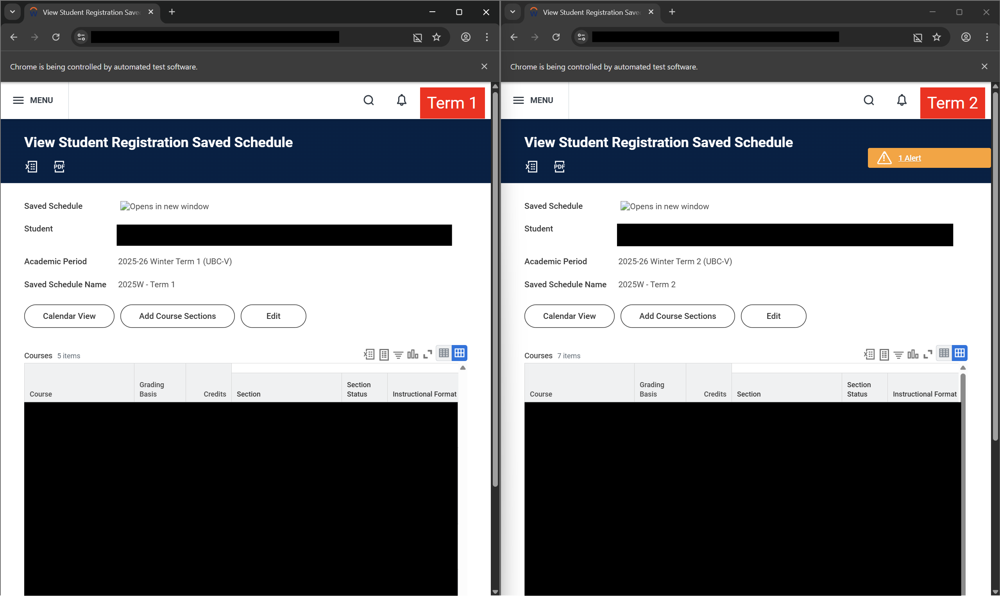

# UBC (Dual Term) Course Sniper

UBC (Dual Term) Course Sniper is a Python script for Windows that automates the process of registering for courses using **two** Saved Schedules (first Term 1, then Term 2) on UBC Workday. It allows users to specify a target time and automatically clicks the registration buttons at that time with millisecond precision. This script is designed to register your Term 1 schedule first, then immediately after, your Term 2 schedule.

## Demo

Video link: https://jmp.sh/YVtxva1l

### ⚠️ **IMPORTANT NOTE** ⚠️

If the order of which you registering the saved schedules **does not matter**, use two simultaneous instances of [UBC Single Term Course Sniper](https://github.com/ExxML/UBC-Single-Term-Course-Sniper) instead. See the video demo for an example of how to do this.

## Installation

1. Clone the repository.
2. Install Python 3.12.
3. Initialize a virtual environment, then install the required dependencies by running:
```bash
pip install -r requirements.txt
```

## Usage

*Connect to Ethernet for best possible results!*
1. ⭐ **IMPORTANT:** Before running `main.py`, modify the `hour` and `minute` variables to match your course registration time **in PST, as assigned by UBC**. These variables are marked with the comment: `### MODIFY TO MATCH YOUR COURSE REGISTRATION TIME IN PST (24-hour time) ###`. ⭐
2. Run `main.py`. It is recommended to run this program AT LEAST 30 seconds prior to your course registration time. **You will be prompted to run the program as Administrator so that your computer time can be automatically synced.**
3. In both Chrome windows that open, log in to UBC Workday with your CWL.
4. Open two Saved Schedules IN THE CORRESPONDING "TERM" WINDOWS. There is a label in the top-right corner of each window indicating the term window.

5. Once you are on this page, press `Enter` in the terminal to start the script.
6. The script will wait until the target time to refresh the page and automatically click the registration buttons (first on the Term 1 window, then Term 2).